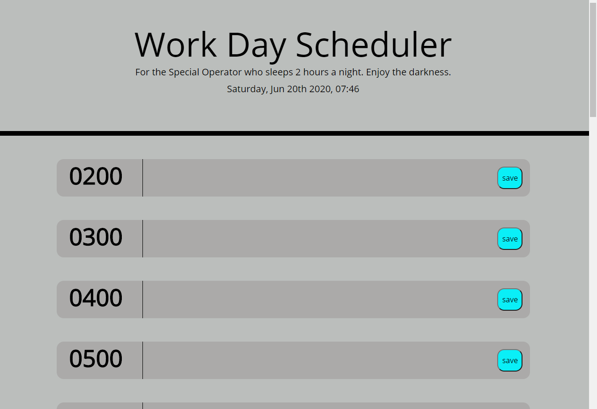

# UCF_Week_03_Homework--Third-Party_APIs
In this assignment we create a calendar application. This app will run in the browser and feature dynamically updated HTML and CSS powered by JQuery. We  used the Moment.js script which makes it easy to get the time at this particular instance. We used Bootstrap and also google fonts. This assignment involved using many externally linked libraries as well as JavaScript logic. We also learned to use local storage to save data.

### Prerequisites and Deployment

* Installation of Web Browser to view webpage
* Visual Studio Code to analze the code for the website
* Bootstrap: Either call it remotely or download it locally and then call it.
* Google fonts
* Moment.js
## Built With

* Visual Studio Code

## Author

* **Lam Nguyen**

## License

There is no license with this homework assignment

## Screenshots

